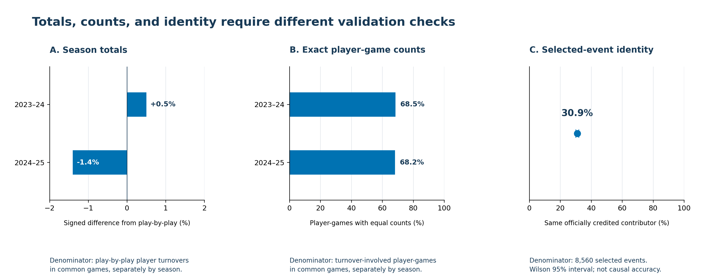
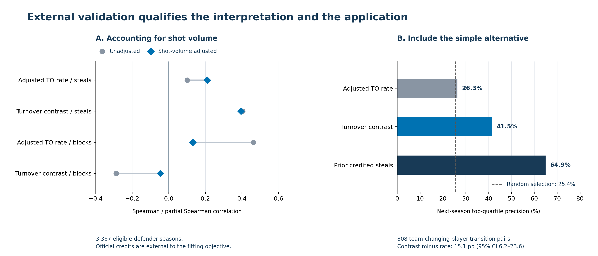

# Stable Rankings, Uncertain Attribution: Validating NBA Matchup Turnover Metrics

## Introduction

Stable matchup turnover rankings and closely reconciled totals can leave defender attribution unresolved. We audit public NBA matchup records and test what their season-level scores measure before using them for player comparisons.

## Methods

We analyze eight regular seasons of matchup networks. A two-season audit compares totals and player-game counts with play-by-play, then examines 8,560 singleton-recoverable turnovers with a credited stealer or named offensive-foul drawer. These selected events permit identity comparison, not causal attribution. We compare a turnover rate adjusted for offensive player and defensive team with a joint count model that separates engagement, turnover contrast, and foul-versus-shot mix. We assess associations with play-by-play credits, including adjustment for matchup shot volume, and evaluate prior-season screens against next-season credited steals in 808 team-changing player-transition pairs.

## Results

Season totals differ from play-by-play by +0.5% and -1.4%, yet the matchup assignment matches the credited contributor in only 30.9% of selected events (Wilson 95% interval 29.9%–31.9%). Agreement is 16.0% for bad passes and 48.1% for lost balls; subtype differences do not identify the assignment mechanism. A margin-preserving reassignment can leave every total unchanged, so aggregate reconciliation cannot establish assignment validity. Identity disagreement does not establish exclusive responsibility or a league-wide error rate.

Turnover contrast correlates with credited steals at 0.405, versus 0.100 for adjusted turnover rate; after adjusting for shot volume, the correlations are 0.395 and 0.210. The apparent contrast with shot blocking largely attenuates after this adjustment. Next-season top-quartile precision is 41.5% for turnover contrast and 26.3% for adjusted turnover rate, a 15.1 percentage-point difference (defender-cluster bootstrap 95% interval 6.2–23.6). Expected precision under random selection with the same quotas is 25.4%; prior-season credited steals are stronger at 64.9%. The contrast advantage over adjusted turnover rate is absent in the perimeter stratum and similar among non-changers, limiting acquisition and role-specific claims. Independent human video validation is not available.

## Conclusion

The contribution is a validation workflow: check assignment separately from totals, evaluate what a score measures, and test its intended use against simple alternatives. Decomposition helps diagnose pooled matchup rankings; it does not recover true defensive credit or establish safe player decisions. The workflow determines which interpretations require further documentation or film review; its effect on staff decisions remains untested.

## Figure 1

Aggregate discrepancies, exact player-game agreement, and selected-event identity agreement have different denominators.

## Figure 2

TO denotes turnover. Shot-volume adjustment qualifies construct interpretation; the screening comparison includes random selection and the stronger simple alternative.
